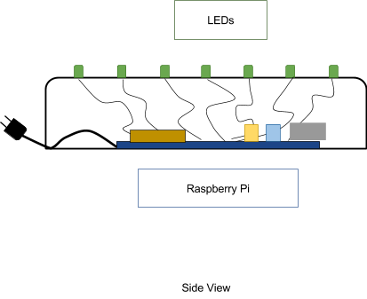

# Clock Kit
 
## Project Description: 

This project creates a data visualization clock by using a Raspberry Pi and LEDs. When connected to the Internet, the Raspberry Pi can be programmed to capture real time or static data which can then be displayed on the clock face. The traditional clock face is represented with an RGB LED at each of the twelve numbers.
 
## Purpose: 

To provide the user with opportunity to learn manufacturing, electronics, programming, and research using big data.
 
## Diagrams:

## Software Programs: 
* CAD program, 
* Raspbian OS, 
* Python
 
## Hardware (Parts list): 
* Piece of wood (dimensions)
* 12 RGB LEDs
  * PTH Addressable https://www.sparkfun.com/products/12999
* Wire
* Raspberry Pi Zero W
  * microB to USB A adapter (https://www.adafruit.com/product/1099)
  * micro HDMI to HDMI adapter (https://www.adafruit.com/product/2819)
  * micro SD card (https://www.adafruit.com/product/1294)
* Micro-USB power adapter or battery pack
* Soldering Iron (optional)
* Prototyping Breadboard (optional)
 
## Tutorials and Helpful Links:
 
* Raspberry Pi Clock Python program: https://github.com/rasathus/RGBLedClock
* Code for LPD6803 module:
  * https://github.com/rasathus/pigredients/blob/master/pigredients/ics/lpd6803.py
  * https://github.com/adafruit/LPD6803-RGB-Pixels
 
 
## Other clock ideas:
* http://tobiscorner.floery.net/rgb-pixel-clock-part-1/
* http://www.jeremyblum.com/2016/02/03/wordclock/
* http://iqjar.com/jar/raspberry-pi-binary-led-clock/
 

